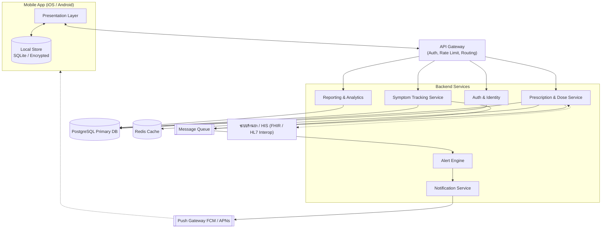
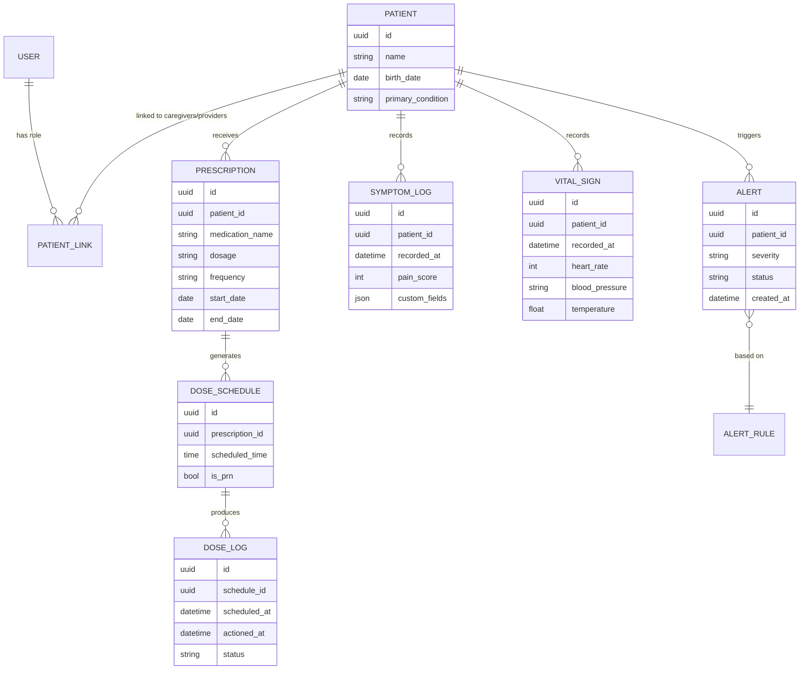

# MedTrack — โครงสร้างแอปจ่ายยาและติดตามอาการผู้ป่วย

> Solution Architecture Draft · แพลตฟอร์ม: Mobile (iOS · Android) + Web Dashboard · สถานะ: ฉบับร่างสำหรับพิจารณา

MedTrack แก้ปัญหาหลักสองเรื่องที่มักแยกกันคนละแอป คือ "กินยาตรงเวลาหรือไม่" และ
"อาการเปลี่ยนแปลงอย่างไรหลังกินยา" โดยเชื่อมสองเรื่องนี้เข้าด้วยกัน เพื่อให้เห็นความสัมพันธ์ระหว่าง
การใช้ยากับอาการของผู้ป่วยจริง

## 1. ภาพรวม & เป้าหมาย

1. เพิ่มอัตรา medication adherence ด้วยการแจ้งเตือนและบันทึกการกินยาที่ทำได้ในไม่กี่วินาที
2. เก็บบันทึกอาการ (pain score, สัญญาณชีพ, ผลข้างเคียง) แบบต่อเนื่องเพื่อดูแนวโน้ม ไม่ใช่แค่ค่าเดี่ยว ๆ
3. ให้ผู้ดูแลและบุคลากรทางการแพทย์เห็นภาพเดียวกันแบบเรียลไทม์ ลดการโทรถามอาการ
4. แจ้งเตือนทันทีเมื่อพลาดยาสำคัญ หรืออาการเข้าเกณฑ์ผิดปกติที่ตั้งไว้

## 2. บทบาทผู้ใช้งาน

| บทบาท | ใช้งานหลัก | สิทธิ์การเข้าถึงข้อมูล |
|---|---|---|
| **ผู้ป่วย** (Patient) | รับแจ้งเตือนยา, กดยืนยันกินยา, บันทึกอาการรายวัน | ข้อมูลของตนเองเท่านั้น |
| **ผู้ดูแล** (Caregiver) | ติดตามผู้ป่วยที่ผูกบัญชีไว้, รับแจ้งเตือนเมื่อพลาดยา/อาการผิดปกติ | ผู้ป่วยที่ได้รับสิทธิ์เชื่อมโยงเท่านั้น |
| **บุคลากรทางการแพทย์** (พยาบาล/เภสัชกร/แพทย์) | สั่งยา ปรับตารางยา ดูแนวโน้มอาการ ออกความเห็นทางคลินิก | ผู้ป่วยในความดูแลของหน่วยงาน/คลินิก |
| **ผู้ดูแลระบบ** (Admin) | จัดการบัญชี สิทธิ์ผู้ใช้ ตรวจสอบ audit log | ระดับองค์กร ไม่เห็นข้อมูลทางคลินิกโดยตรง |

## 3. โมดูลหลัก

1. **ใบสั่งยา & ตารางยา (Prescription & Dose Schedule)** — Core
   แปลงใบสั่งยาเป็นตารางเวลาที่ตั้งเตือนได้อัตโนมัติ รองรับยาหลายมื้อ ยาตามอาการ (PRN)
   และการปรับขนาดยาระหว่างทาง
2. **แจ้งเตือน & บันทึกการกินยา (Reminder & Dose Log)** — Core
   Push notification ตรงเวลา พร้อมช่องทางยืนยันที่เร็วที่สุด สถานะโดสยา: taken / skipped /
   snoozed / missed, escalation หากไม่ตอบสนอง, คำนวณ adherence rate
3. **ติดตามอาการ (Symptom Tracking)** — Core
   แบบบันทึกอาการที่ปรับตามชนิดโรค เช่น pain scale (0–10), อารมณ์, สัญญาณชีพ และผลข้างเคียงจากยา
4. **แจ้งเตือนฉุกเฉิน (Alert Engine)** — Critical
   เครื่องมือกำหนดกฎ (rule-based) สำหรับพลาดยาซ้ำหลายครั้ง หรือค่าอาการเกินเกณฑ์ที่แพทย์ตั้งไว้
5. **แดชบอร์ดผู้ดูแล/บุคลากร (Care Dashboard)** — Web + Mobile
   มุมมองสรุปรายผู้ป่วย adherence, แนวโน้มอาการ และแจ้งเตือนที่ค้างอยู่ในหน้าเดียว
6. **บัญชีผู้ใช้ & การเชื่อมโยง (Account & Linking)** — Core
   จัดการตัวตน สิทธิ์การเข้าถึง และการผูกบัญชีระหว่างผู้ป่วย-ผู้ดูแล-บุคลากร ด้วยรหัสเชิญหรือ QR

## 4. สถาปัตยกรรมระบบระดับสูง

Mobile client แบบ offline-first คุยกับ backend ผ่าน API Gateway เดียว แยกบริการภายในตามโมดูลด้านบน
เพื่อ scale และ deploy แยกกันได้



> Alert Engine แยกเป็น service ต่างหากโดยเจตนา เพราะกฎการแจ้งเตือนต้องทำงานแบบ near real-time
> และอาจต้องปรับความไวได้บ่อยโดยไม่กระทบ service อื่น

## 5. โครงสร้างแอปมือถือ (Clean Architecture)

แบ่งเป็น 3 ชั้น:

- **Presentation** — หน้าจอ, widget, state management — รู้จักแค่ use case
- **Domain** — Entities และ use case ไม่ผูกกับ framework ใด ๆ
- **Data** — Repository ตัดสินใจว่าจะอ่านจาก local cache หรือยิง API พร้อม sync queue สำหรับโหมด offline

```
lib/
├── app/                      # entry point, routing, DI container
├── core/
│   ├── network/               # api client, interceptors
│   ├── storage/                # local db, secure storage
│   └── notification/          # local & push notification handling
├── features/
│   ├── medication/
│   │   ├── presentation/       # screens, widgets, view-model
│   │   ├── domain/              # entities, use cases
│   │   └── data/                 # repository, dto, local/remote source
│   ├── symptom_tracking/
│   │   ├── presentation/
│   │   ├── domain/
│   │   └── data/
│   ├── alerts/
│   ├── dashboard/               # สำหรับ role ผู้ดูแล/บุคลากร
│   └── auth/
└── shared/
    ├── widgets/                # ปุ่ม, การ์ด, chart ที่ใช้ร่วมกัน
    └── theme/                   # สี, ตัวอักษร, spacing tokens
```

## 6. โครงสร้างข้อมูลหลัก



## 7. การออกแบบ API (ตัวอย่าง)

REST + JWT เป็นจุดเริ่มต้นที่เพียงพอสำหรับ MVP ส่วน event ที่ต้อง real-time (แจ้งเตือน) ใช้
push notification แทน WebSocket เพื่อประหยัดแบตเตอรี่มือถือ

| Method | Endpoint | คำอธิบาย |
|---|---|---|
| POST | `/v1/auth/login` | เข้าสู่ระบบ, คืน access + refresh token |
| GET | `/v1/patients/{id}/schedule/today` | ตารางยาวันนี้ของผู้ป่วย |
| POST | `/v1/dose-logs` | บันทึกการกินยา (taken/skipped) |
| POST | `/v1/symptom-logs` | บันทึกอาการประจำวัน |
| GET | `/v1/patients/{id}/trends` | ข้อมูลแนวโน้มยา + อาการสำหรับกราฟ |
| PUT | `/v1/prescriptions/{id}` | แก้ไขใบสั่งยา (บุคลากรเท่านั้น) |
| GET | `/v1/alerts?status=open` | รายการแจ้งเตือนที่ยังไม่ถูกรับทราบ |
| POST | `/v1/alerts/{id}/acknowledge` | รับทราบการแจ้งเตือน |
| DELETE | `/v1/patient-links/{id}` | ยกเลิกการเชื่อมโยงผู้ดูแล/บุคลากร |

## 8. เทคโนโลยีที่แนะนำ

| ชั้นระบบ | ตัวเลือกแนะนำ | เหตุผล |
|---|---|---|
| Mobile App | Flutter | โค้ดเดียวรัน iOS/Android, เหมาะกับทีมเล็กที่ต้องการความเร็ว |
| Local Storage | SQLite (เข้ารหัส) + Secure Storage สำหรับ token | รองรับโหมด offline และข้อมูลสุขภาพต้องเข้ารหัสที่ตัวเครื่อง |
| Backend API | NestJS (Node.js) หรือ .NET | โครงสร้าง module ชัดเจน ตรงกับการแบ่ง service ด้านบน |
| ฐานข้อมูลหลัก | PostgreSQL | รองรับ JSON field และมี extension ด้าน time-series |
| Cache / Queue | Redis + message queue (เช่น RabbitMQ) | แยก alert engine ออกจาก request-response หลัก |
| Push Notification | Firebase Cloud Messaging + APNs | มาตรฐานอุตสาหกรรม รองรับทั้งสองแพลตฟอร์ม |
| Auth | OAuth2 / JWT + MFA สำหรับบุคลากร | แยกระดับความเข้มงวดตามบทบาทผู้ใช้ |
| Interoperability | FHIR API | มาตรฐานเปิดที่ระบบ HIS ส่วนใหญ่รองรับ |

## 9. ความปลอดภัย & การปฏิบัติตามข้อกำหนด

- เข้ารหัสข้อมูลทั้งระหว่างส่ง (TLS 1.2+) และขณะพัก (encryption at rest)
- Consent management — ผู้ป่วยต้องยินยอมก่อนแชร์ข้อมูล และยกเลิกได้ทุกเมื่อ
- สอดคล้องกับ พ.ร.บ.คุ้มครองข้อมูลส่วนบุคคล (PDPA) เนื่องจากข้อมูลสุขภาพเป็นข้อมูลอ่อนไหว
- Audit log บันทึกทุกการเข้าถึง/แก้ไขใบสั่งยาและข้อมูลอาการ
- Role-based access control จำกัดสิทธิ์ตามบทบาทในตาราง §2 อย่างเคร่งครัดที่ระดับ API

## 10. Offline & Sync Strategy

- ตารางยาวันนี้/พรุ่งนี้ถูก cache ไว้ในเครื่องล่วงหน้าเสมอ
- การกดยืนยันกินยา/บันทึกอาการเขียนลง local DB ก่อน แล้วเข้าคิว sync เมื่อมีสัญญาณ
- ใช้ local notification เป็นตัวหลักสำหรับเตือนกินยา ไม่พึ่ง push notification เพียงอย่างเดียว
- Conflict resolution แบบ last-write-wins สำหรับข้อมูล log เนื่องจากเป็นข้อมูล append เป็นหลัก

## 11. แผนการพัฒนา

| Phase | หัวข้อ | รายละเอียด |
|---|---|---|
| 1 · MVP | กินยาตรงเวลา + บันทึกอาการพื้นฐาน | บัญชีผู้ใช้, ใบสั่งยา, ตารางเตือนยา, dose log, บันทึกอาการ (pain score) — ผู้ป่วยคนเดียวไม่มีผู้ดูแล |
| 2 · เชื่อมโยงคน | ผู้ดูแลและแดชบอร์ดติดตาม | ผูกบัญชีผู้ดูแล, แดชบอร์ดสรุปสถานะ, แจ้งเตือนเมื่อพลาดยา, กราฟแนวโน้ม |
| 3 · คลินิก | เปิดให้บุคลากรทางการแพทย์ใช้งาน | สั่งยา/ปรับตารางยาจากฝั่งบุคลากร, Alert Engine ตั้งกฎได้, audit log เต็มรูปแบบ |
| 4 · ต่อยอด | Interoperability & อุปกรณ์เสริม | เชื่อมต่อ FHIR, กล่องจ่ายยาอัจฉริยะ (IoT), อุปกรณ์วัดสัญญาณชีพแบบสวมใส่ |

---

_ปัจจุบัน repo นี้อยู่ระหว่างพัฒนา Phase 1 (MVP) — ดูโครงสร้างโค้ดจริงได้ที่ `backend/` (NestJS API)
และ `mobile/` (Flutter app)._
